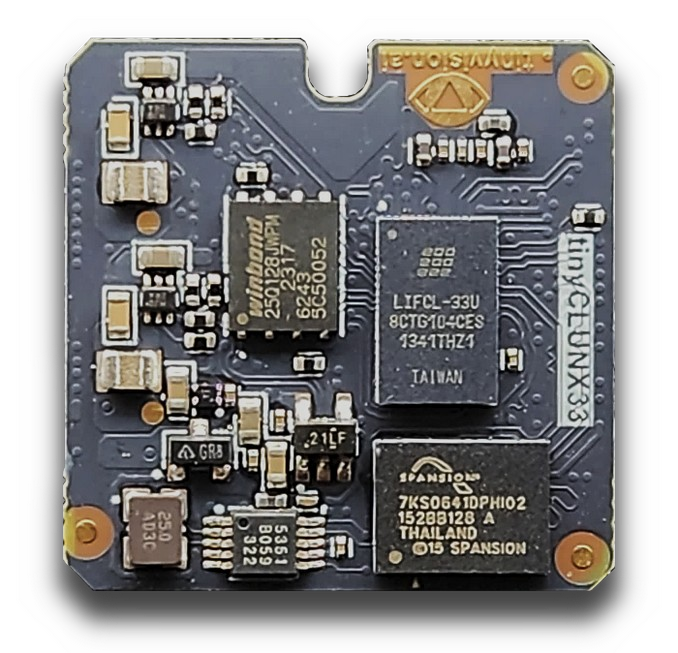

Video on Zephyr
###############

.. warning::

   The boards presented here have not all been tested with all
   use-cases, and support for some hardware is still a work in
   progress.

.. warning::

   The speeds are directly out of the datasheet. It is typically
   not possible to reach the max spead for any system, but it
   gives an idea of the class of device they belong to.

A presentation to show the diversity of hardwrare that can run
Zephyr today.

Glossary
********

Terms that might need to be explained.

:NPU:
   Neural Processing Unit: core computes efficiently large grid of
   small numbers (i.e. 8-bit, 4-bit...), supported operations needed
   for neural network inference (the last step of "A.I.").

:IMU:
   Inertial Measurement Unit: Sensor that detects change in
   orientation and movements, useful for estimating the motion or
   position of a device.

i.MX RT1170
***********

Cortex-M7 (small-medium) running at 1 GHz.

A fast CPU is good to reduce RAM usage:
transmit *more often* rather than *more at once*.

.. image:: img/MIMXRT1170-EVKB.jpg
   :width: 100%

.. code-block::

   MIPI camera input (nxp,mipi-csi2rx) 1500 MHz, 2-lanes
   |||||||||||||||||||||||||||||||||||||||||||||||||||||||||||||||||||||||||||
   ||||||||||||||||||||||||||||||||||||||||||||||||||||||||||||||||||||||||||| 3000 MHz

   MIPI display output (nxp,imx-mipi-dsi) 1500 MHz, 2-lanes
   |||||||||||||||||||||||||||||||||||||||||||||||||||||||||||||||||||||||||||
   ||||||||||||||||||||||||||||||||||||||||||||||||||||||||||||||||||||||||||| 3000 MHz

   USB2 (nxp,ehci)
   |||||||||||||||||||||||| 480 MHz

   Ethernet (nxp,enet1g)
   |||||||||||||||||||||||||||||||||||||||||||||||||| 1000 MHz

   CPU cores (arm,cortex-m7 + arm,cortex-m4)
   |||||||||||||||||||||||||||||||||||||||||||||||||| 1000 MHz
   |||||||||||||||||||| 400 MHz

   + Video processing cores (cropping, resizing, color conversion)

FRDM-MCXN947
************

Dual Cortex-M33 (small) system with peripherals usually only found on
larger Linux-capable devices: "do more with less"

.. image:: img/FRDM-MCXN947.jpg
   :width: 100%

.. code-block::

   DVP camera input (nxp,video-smartdma) 16 pins max, 150 MHz each
   |||||||| |||||||| |||||||| |||||||| |||||||| |||||||| |||||||| 1200 MHz

   USB2 (nxp,ehci)
   |||||||||||||||||||||||| 480 MHz

   Ethernet (nxp,enet-qos)
   ||||| 100 MHz

   CPU cores (arm,cortex-m33f)
   |||||||| 150 MHz
   |||||||| 150 MHz

   + eIQ NPU on-board for A.I. inference (release planned 2025 [1])

[1]: `eIQ`_ application note

.. _eIQ: https://community.nxp.com/pwmxy87654/attachments/pwmxy87654/MCX%40tkb/9/14/Add%20Machine%20Learning%20Functionality%20to%20Your%20NXP%20MCU-based%20Design%20(Tech%20Days%202024).pdf

WeAct MiniSTM32H7xx
*******************

Minimalist approach to a video devboard, comes with a camera and a display and fast USB.

.. image:: img/Weaxie-STM32H743.png
   :width: 100%

.. code-block::

   DVP camera input (st,stm32-dcmi) 14 pins max, 80 MHz each
   |||| |||| |||| |||| |||| |||| |||| |||| 640 MHz

   USB2 (st,stm32-otghs / st,stm32-otghs)
   |||||||||||||||||||||||| 480 MHz
   | 12 MHz

   Ethernet (st,stm32h7-ethernet)
   ||||| 100 MHz

   CPU core (arm,cortex-m7)
   |||||||||||||||||||||||| 480 MHz

   + JPEG compression core
   + Video processing operations (cropping, resizing, color conversion)

Arduino Nicla Vision (STM32H747)
********************************

All-in-one board with IMU, microphone, 2 MP camera built-in, fast USB.

.. image:: img/Arduino-Nicla-Vision.png
   :width: 100%

.. code-block::

   DVP camera input (st,stm32-dcmi) 14 pins max, 80 MHz each
   |||| |||| |||| |||| |||| |||| |||| |||| 640 MHz

   USB2 (st,stm32-otghs)
   |||||||||||||||||||||||| 480 MHz

   Wi-Fi (murata,1dx)
   |||| 65 Mbit/s

   CPU cores (arm,cortex-m7 + arm,cortex-m4)
   |||||||||||||||||||||||| 480 MHz
   |||||||||||| 240 MHz

   + JPEG compression core
   + Video processing operations (cropping, resizing, color conversion)

XIAO ESP32S3 Sense
******************

Self-contained board for wireless (WiFi, Bluetooth).

.. image:: img/Xiao-ESP32-S3-Sense.jpg
   :width: 100%

.. code-block::

   16-pins max, 40/80 MHz each
   |||| |||| |||| |||| |||| |||| |||| |||| 640 MHz

   Wi-Fi (espressif,esp32-wifi)
   |||||||| 150 Mbit/s

   CPU core (espressif,xtensa-lx7 + espressif,xtensa-lx7)
   |||||||||||| 240 MHz
   |||||||||||| 240 MHz

tinyVision.ai tinyCLUNX33
*************************

A system specialized for MIPI to USB3 camera systems.
An FPGA: very slow CPU and needs to "build your own video cores".
Not upstream yet.

.. code-block::

   MIPI (tinyvision,uvcmanager) 10 lanes max, 1200 MHz each
   |||||||||||||||||||||||||||||||||||||||||||||||||||||||||||||||||||||||||||
   |||||||||||||||||||||||||||||||||||||||||||||||||||||||||||||||||||||||||||
   |||||||||||||||||||||||||||||||||||||||||||||||||||||||||||||||||||||||||||
   |||||||||||||||||||||||||||||||||||||||||||||||||||||||||||||||||||||||||||
   |||||||||||||||||||||||||||||||||||||||||||||||||||||||||||||||||||||||||||
   |||||||||||||||||||||||||||||||||||||||||||||||||||||||||||||||||||||||||||
   |||||||||||||||||||||||||||||||||||||||||||||||||||||||||||||||||||||||||||
   ||||||||||||||||||||||||||||||||||||||||||||||||||||||||||||||||||||||||||| 12000 MHz
 
   USB3 (lattice,usb23)
   |||||||||||||||||||||||||||||||||||||||||||||||||||||||||||||||||||||||||||
   |||||||||||||||||||||||||||||||||||||||||||||||||||||||||||||||||||||||||||
   |||||||||||||||||||||||||||||||||||||||||||||||||||||||||||||||||||||||||||
   ||||||||||||||||||||||||| 5000 MHz

   CPU core (tinyvision,vexriscv)
   |||| 80 MHz
