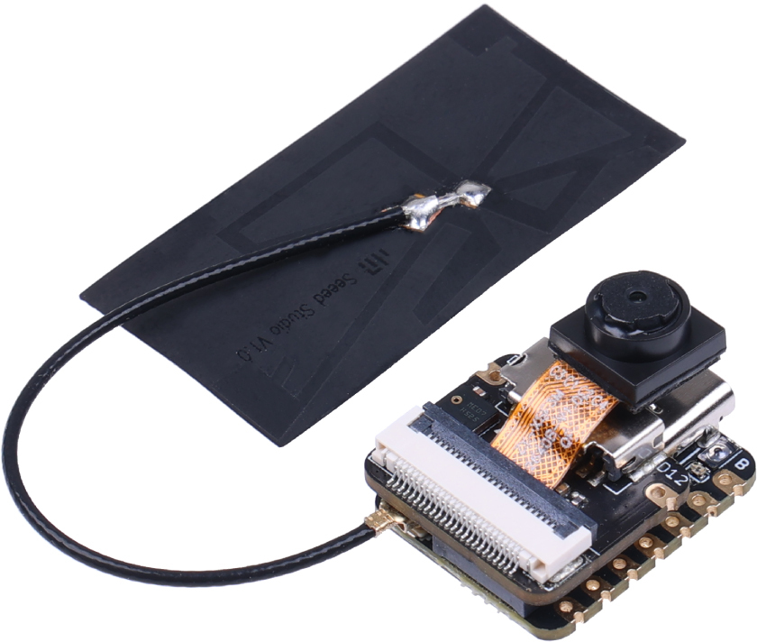

XIAO ESP32S3 Sense
******************

Self-contained board for wireless (WiFi, Bluetooth).

.. code-block::

   DVP (espressif,lsd-cam)
   |||| |||| |||| |||| |||| |||| |||| |||| 8 pins (16 max) 80 MHz each

   Wi-Fi (espressif,esp32-wifi)
   |||||||| 150 Mbit/s

   CPU core (espressif,xtensa-lx7 + espressif,xtensa-lx7)
   |||||||||||| 240 MHz
   |||||||||||| 240 MHz
