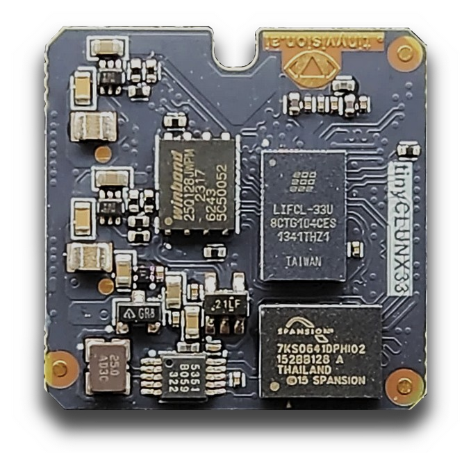

tinyVision.ai tinyCLUNX33
*************************

A system specialized for MIPI to USB3 camera systems.
An FPGA: very slow CPU and needs to "build your own video cores".
Not upstream yet.

.. code-block::

   MIPI (tinyvision,uvcmanager) 10 lanes max, 1200 MHz each
   |||||||||||||||||||||||||||||||||||||||||||||||||||||||||||||||||||||||||||
   |||||||||||||||||||||||||||||||||||||||||||||||||||||||||||||||||||||||||||
   |||||||||||||||||||||||||||||||||||||||||||||||||||||||||||||||||||||||||||
   |||||||||||||||||||||||||||||||||||||||||||||||||||||||||||||||||||||||||||
   |||||||||||||||||||||||||||||||||||||||||||||||||||||||||||||||||||||||||||
   |||||||||||||||||||||||||||||||||||||||||||||||||||||||||||||||||||||||||||
   |||||||||||||||||||||||||||||||||||||||||||||||||||||||||||||||||||||||||||
   ||||||||||||||||||||||||||||||||||||||||||||||||||||||||||||||||||||||||||| 12000 MHz
 
   USB3 (lattice,usb23)
   |||||||||||||||||||||||||||||||||||||||||||||||||||||||||||||||||||||||||||
   |||||||||||||||||||||||||||||||||||||||||||||||||||||||||||||||||||||||||||
   |||||||||||||||||||||||||||||||||||||||||||||||||||||||||||||||||||||||||||
   ||||||||||||||||||||||||| 5000 MHz

   CPU core (tinyvision,vexriscv)
   |||| 80 MHz
