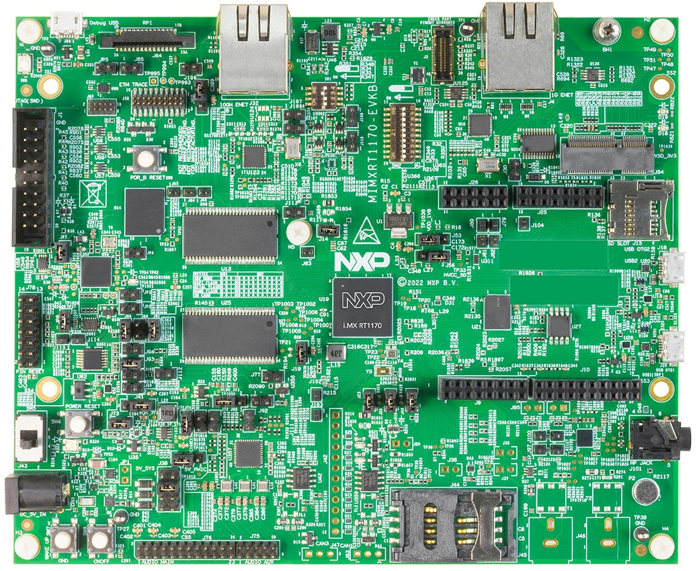

FRDM-MCXN947
************

Dual Cortex-M33 (small) system with peripherals usually only found on
larger Linux-capable devices: "do more with less"

.. image:: img/FRDM-MCXN947.jpg
   :width: 100%

.. code-block::

   DVP camera input (nxp,video-smartdma) 16 pins max, 150 MHz each
   |||||||| |||||||| |||||||| |||||||| |||||||| |||||||| |||||||| 1200 MHz

   USB2 (nxp,ehci)
   |||||||||||||||||||||||| 480 MHz

   Ethernet (nxp,enet-qos)
   ||||| 100 MHz

   CPU cores (arm,cortex-m33f)
   |||||||| 150 MHz
   |||||||| 150 MHz

   + eIQ NPU on-board for A.I. inference (release planned 2025 [1])

[1]: `eIQ`_ application note

.. _eIQ: https://community.nxp.com/pwmxy87654/attachments/pwmxy87654/MCX%40tkb/9/14/Add%20Machine%20Learning%20Functionality%20to%20Your%20NXP%20MCU-based%20Design%20(Tech%20Days%202024).pdf

i.MX RT1170
***********

Cortex-M7 (small-medium) running at 1 GHz.

A fast CPU is good to reduce RAM usage:
transmit *more often* rather than *more at once*.

.. code-block::

   MIPI camera input (nxp,mipi-csi2rx) 1500 MHz, 2-lanes
   |||||||||||||||||||||||||||||||||||||||||||||||||||||||||||||||||||||||||||
   ||||||||||||||||||||||||||||||||||||||||||||||||||||||||||||||||||||||||||| 3000 MHz

   MIPI display output (nxp,imx-mipi-dsi) 1500 MHz, 2-lanes
   |||||||||||||||||||||||||||||||||||||||||||||||||||||||||||||||||||||||||||
   ||||||||||||||||||||||||||||||||||||||||||||||||||||||||||||||||||||||||||| 3000 MHz

   USB2 (nxp,ehci)
   |||||||||||||||||||||||| 480 MHz

   Ethernet (nxp,enet1g)
   |||||||||||||||||||||||||||||||||||||||||||||||||| 1000 MHz

   CPU cores (arm,cortex-m7 + arm,cortex-m4)
   |||||||||||||||||||||||||||||||||||||||||||||||||| 1000 MHz
   |||||||||||||||||||| 400 MHz

   + Video processing cores (cropping, resizing, color conversion)
