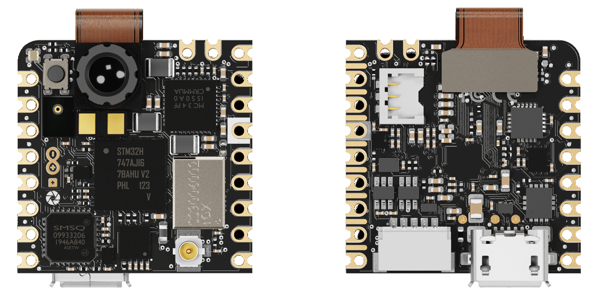
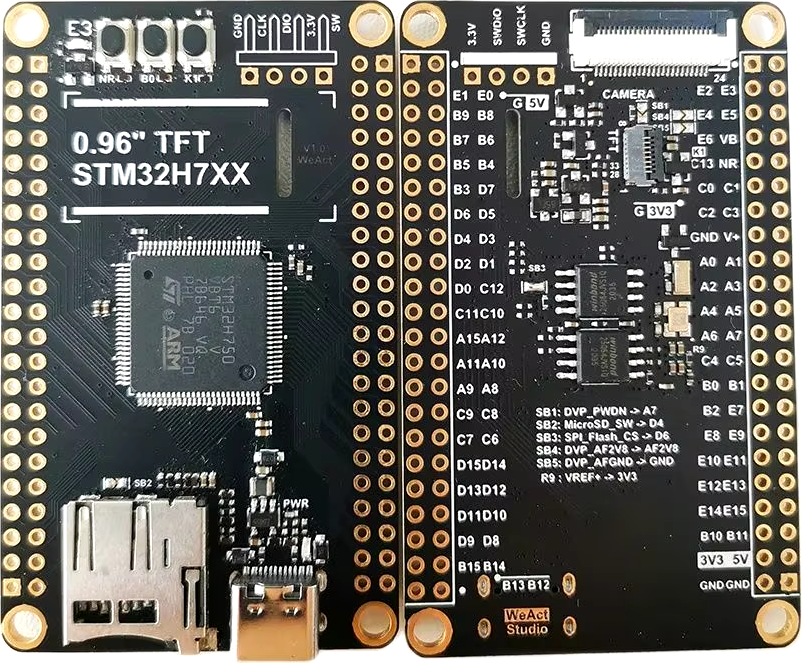

Arduino Nicla Vision (STM32H747)
********************************

All-in-one board with IMU, microphone, 2 MP camera built-in, fast USB.

.. code-block::

   DVP camera input (st,stm32-dcmi) 14 pins max, 80 MHz each
   |||| |||| |||| |||| |||| |||| |||| |||| 640 MHz

   USB2 (st,stm32-otghs)
   |||||||||||||||||||||||| 480 MHz

   Wi-Fi (murata,1dx)
   |||| 65 Mbit/s

   CPU cores (arm,cortex-m7 + arm,cortex-m4)
   |||||||||||||||||||||||| 480 MHz
   |||||||||||| 240 MHz

   + JPEG compression core
   + Video processing operations (cropping, resizing, color conversion)

WeAct MiniSTM32H7xx
*******************

Minimalist approach to a video devboard, comes with a camera and a display and fast USB.

.. code-block::

   DVP camera input (st,stm32-dcmi) 14 pins max, 80 MHz each
   |||| |||| |||| |||| |||| |||| |||| |||| 640 MHz

   USB2 (st,stm32-otghs / st,stm32-otghs)
   |||||||||||||||||||||||| 480 MHz
   | 12 MHz

   Ethernet (st,stm32h7-ethernet)
   ||||| 100 MHz

   CPU core (arm,cortex-m7)
   |||||||||||||||||||||||| 480 MHz

   + JPEG compression core
   + Video processing operations (cropping, resizing, color conversion)
