Embedded Video Systems With Zephyr
##################################

.. class:: titleslideinfo

   Josuah Demangeon, Panoramix Labs, tinyVision.ai

Background
==========

A contractor working essentially with tinyVision.ai

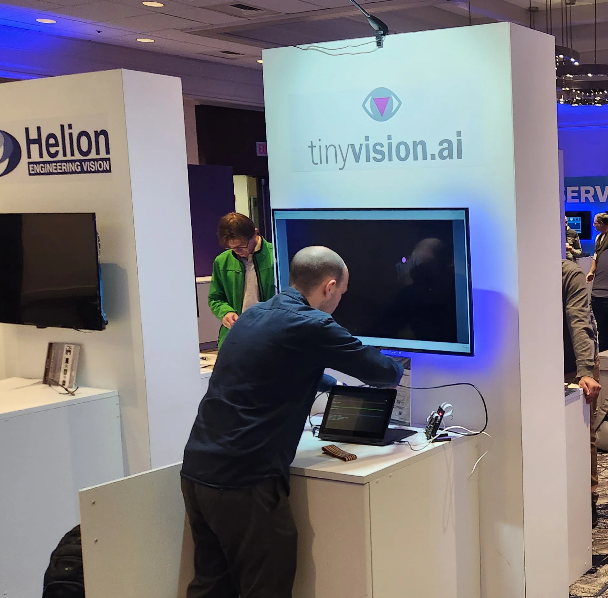

Autoportrait:
I am curious about a lot of topics, but only scratch the surface.

You are welcome and invited to dive in depth!

Video Systems
=============

Famous example: home cinema

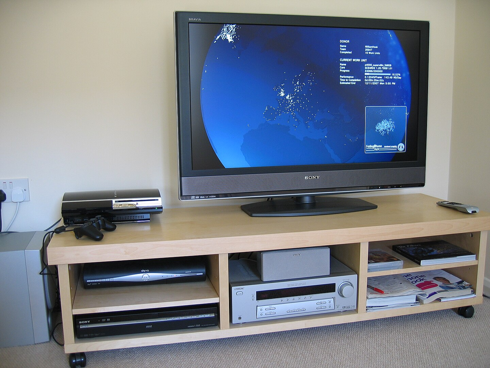

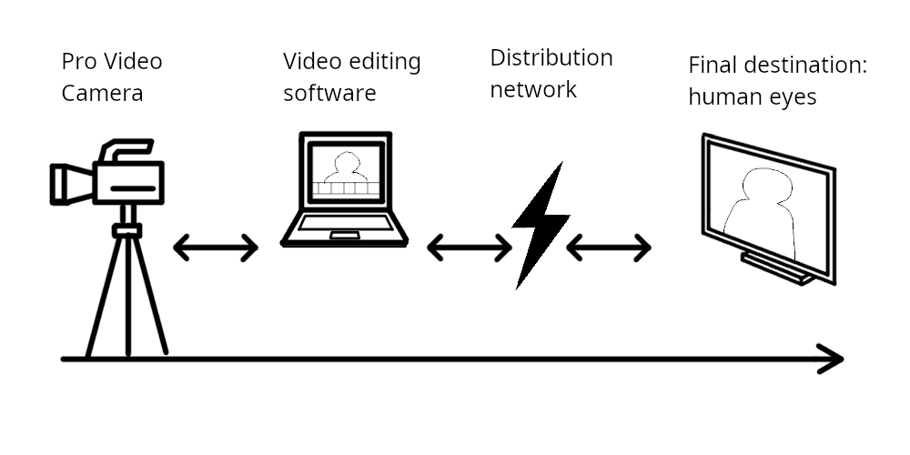

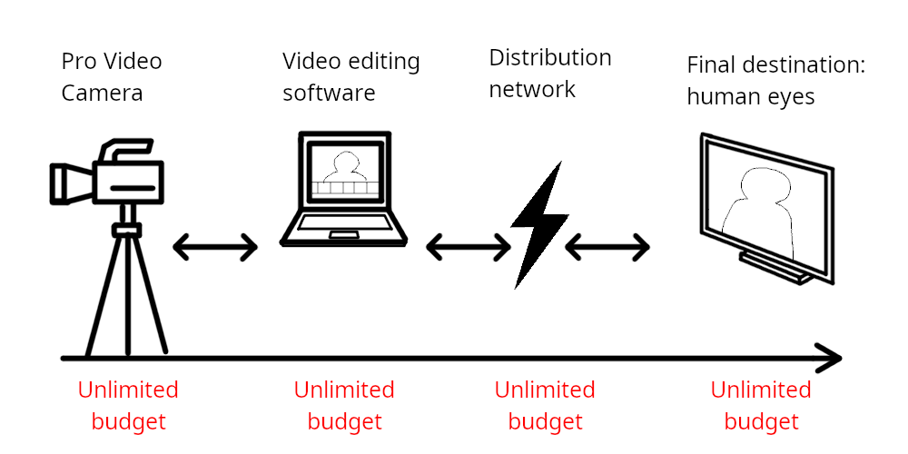

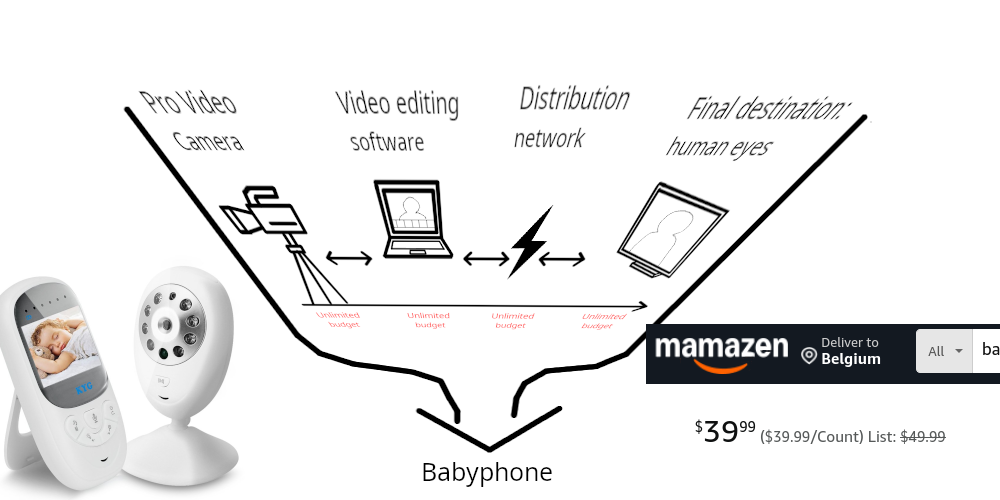

Embedded Video Systems
======================

Constraints:

-> Cost budget

-> Processing budget

-> Time budget (low-latency, real-time)

Can only work at low-resolution...

Embedded Video Systems
======================

Constraints:

-> Cost budget

-> Processing budget

-> Time budget (low-latency, real-time)

Can only work at low-resolution... <- FALSE!

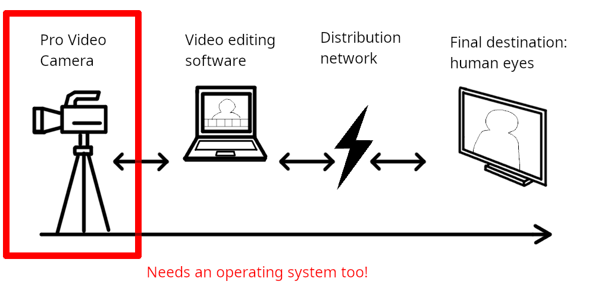

Embedded is not always low-end.

Embedded Video Systems
======================

"Why not use an USB camera?"

We are now implementing the USB camera *itself*.

.. image:: img/tinyclunx33_som_v2.png

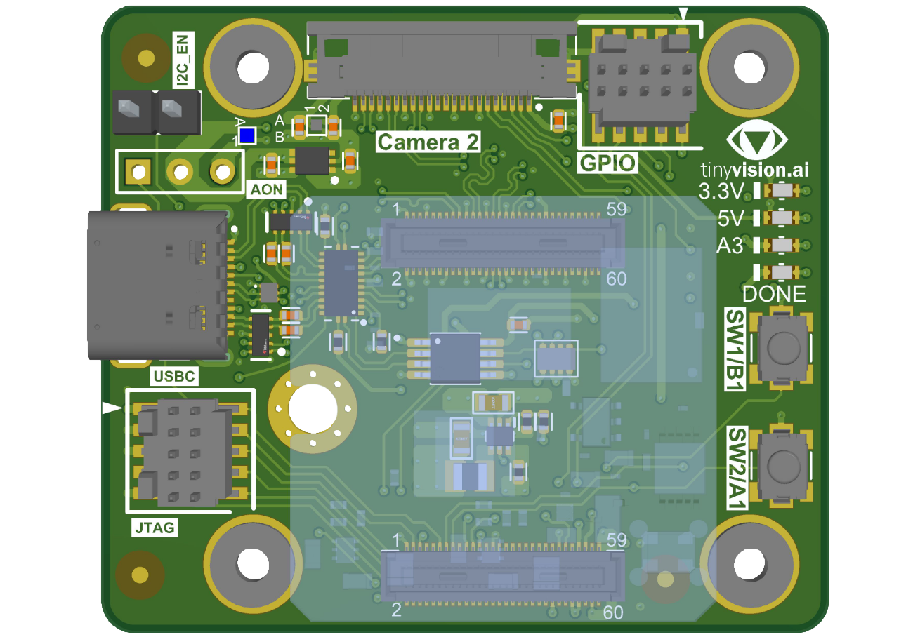

Embedded Video Systems
======================

"Why not just a Raspberry Pi?"

-> Power budget

-> Performance

-> Cost

-> Latency

.. https://www.arducam.com/arducam-pivistation-5/
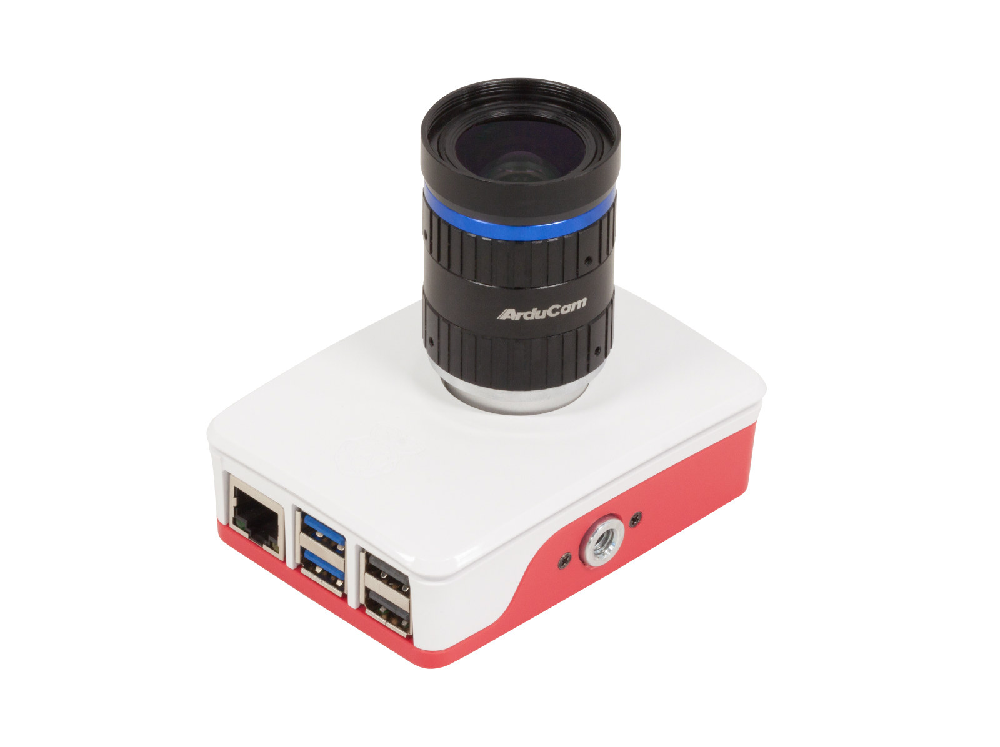

Embedded Video Systems
======================

Can be very large:

.. https://en.wikipedia.org/wiki/Very_Large_Telescope
.. image:: img/very_large_telescope.png

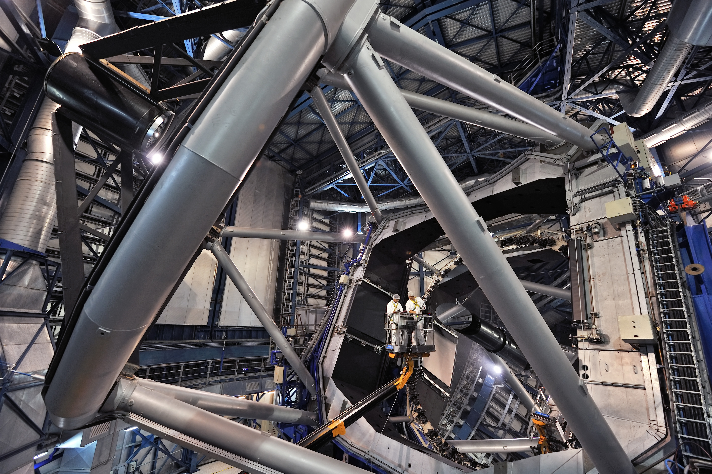

We can imagine a lot involved to assist the video function:

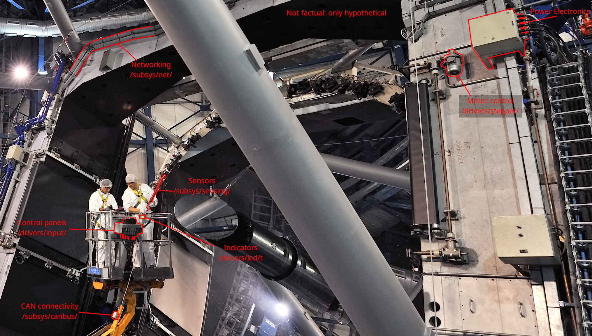

Still there on small embedded systems:

-> Motor for auto-focus ("VCM" motor ``#include <zephyr/drivers/video-controls.h>``)

-> I2C communication with other chips (``#include <zephyr/drivers/i2c.h>``)

-> Turning on/off the chip power (`Power Management <https://docs.zephyrproject.org/latest/services/pm/index.html>`_)

Embedded Video Systems
======================

But usually the smaller the better: how to shrink?

Switch from Linux OS -> RTOS like Zephyr

FFmpeg -> ???

Gstreamer -> ???

OpenCV -> ???

PyTorch -> ???

``/dev/video0`` -> ???

Everything to reinvent!
Needs a new ecosystem.

Zephyr Video APIs
=================

.. https://static.linaro.org/connect/san19/presentations/san19-503.pdf

Systems doing what?
===================

.. https://2384176.fs1.hubspotusercontent-na1.net/hubfs/2384176/Webinars/MIPI-Webinar-Introduction-MIPI-Camera-Command-Set-v1.pdf
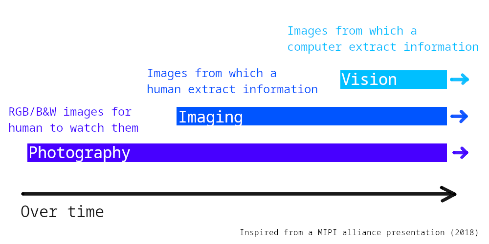

On a journey from Phontons to Video
===================================

Photodiode
==========

Phenomenon of semiconductors producing voltage when exposed to the light.

.. https://hackaday.com/2024/07/23/photoresistor-based-single-pixel-camera/
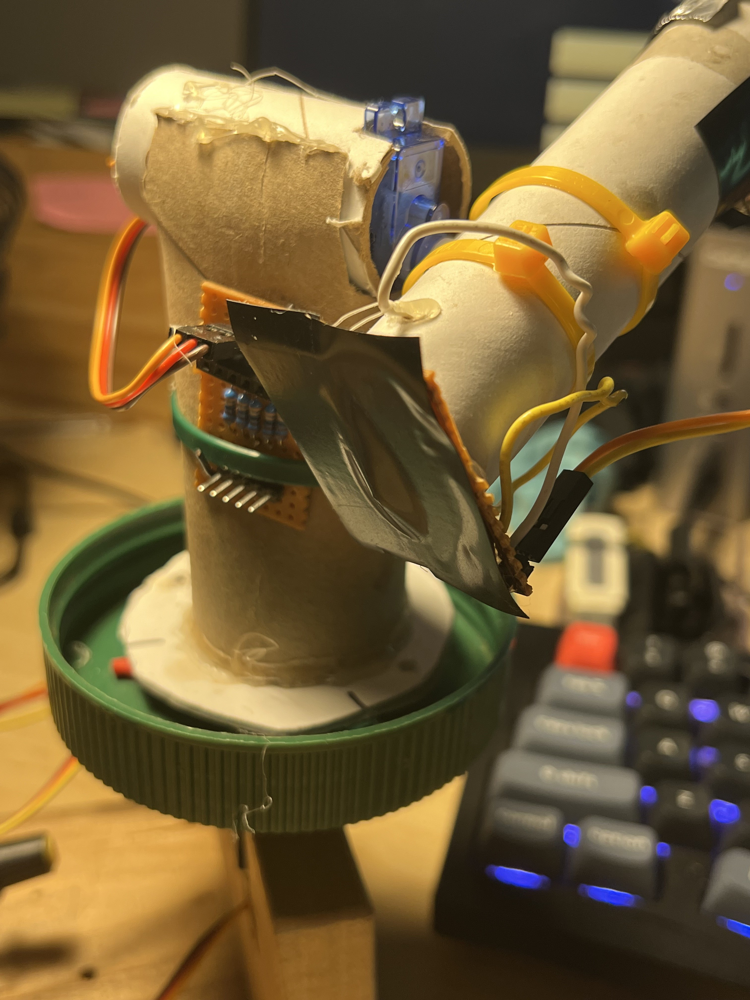
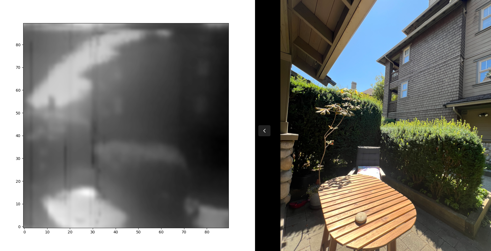

Note: photoresistor instead of photodiode here

.. code-block:: c
   :startinline: true

   #include <zephyr/drivers/pwm.h> // if using servomotors
   #include <zephyr/drivers/stepper.h> // if using stepper motors
   #include <zephyr/drivers/adc.h> // measure the light intensity

Photons -> Photonics
====================

Much more than just video:

-> Gas detection/characterization, i.e. NDIR CO2 sensors 

Industrial, safety, medical use-cases.

Since 1958: measuring Earth atmospheric CO2 with "1-pixel image sensors"

.. https://gml.noaa.gov/ccgg/behind_the_scenes/measurementlab.html
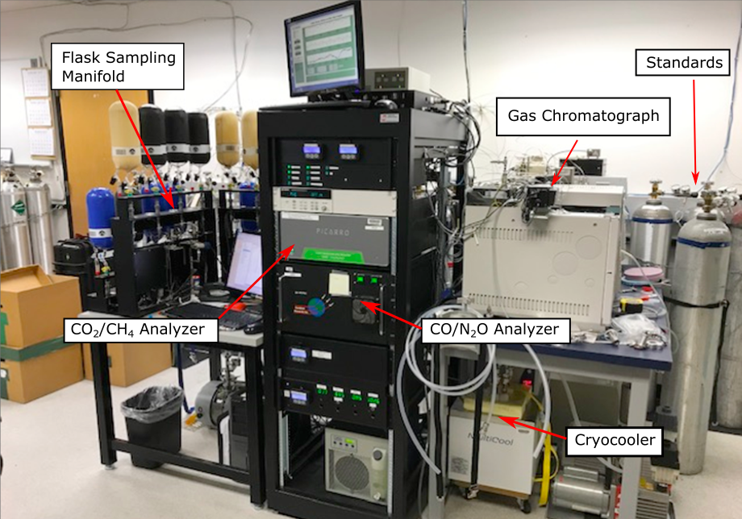

-> Biology/medical research, i.e. DNA sequencing

.. https://www.hamamatsu.com/content/dam/hamamatsu-photonics/sites/documents/99_SALES_LIBRARY/ssd/s13360_series_kapd1052e.pdf
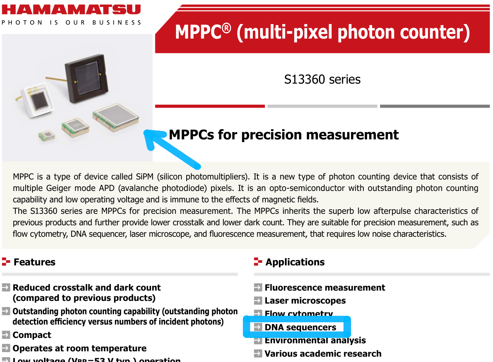

Sensing voltage: not a very Linux thing to do...

Multiple sensors on a line
==========================

Line sensors: single cameras.

External systems measure responsible the voltage.
Sensing one pixel at a time, scanning through them fast.

Requires a fast ADC, i.e. ADI, contributing Zephyr RTOS

Multiple lines
==============

An image sensor, at last!

Line scanning hyperspectral.

Doing imaging but without a machine at the other end: computer vision.

Tools that can be used for building video systems: hardware to access the sensors implement all of that chain

-> Difficulty of embedded video: accessing parallel port or MIPI
-> Can use adapter chips like Himax WiseEye2 (Zephyr port might be coming too)

What comes out of an image sensor
=================================

Dark (no auto-exposure)
Green (no color correction)

Steps of an ISP.

Why an ISP is useful for robotics?

-> Get always values withing same range
-> Poor exposure: no data at all
-> Defisheye
-> Avoid artefacts to trigger a detection on the NPU or other vision algorithm

Conclusion: A lot to handle to get a reasonable image out of a sensor!

Hardware that can help accessing this image.

What it takes...
================

What would it take to build various devices on Zephyr

!! disclaimer: hardware is hard !!
!! disclaimer: not everything supported !!

What it takes... Spectrophotometer
==================================

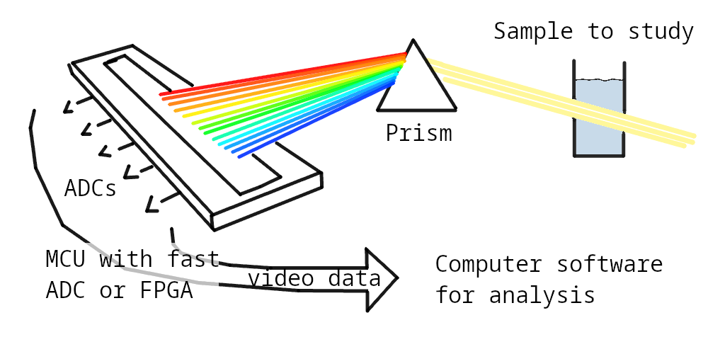

Need a very fast ADC!
Not many board will have one...

=> Good to have a lot of options.

FPGAs are often used for this: Zephyr support depends on the soft SoC used.

.. https://github.com/OpnTec/open-spectrometer-python

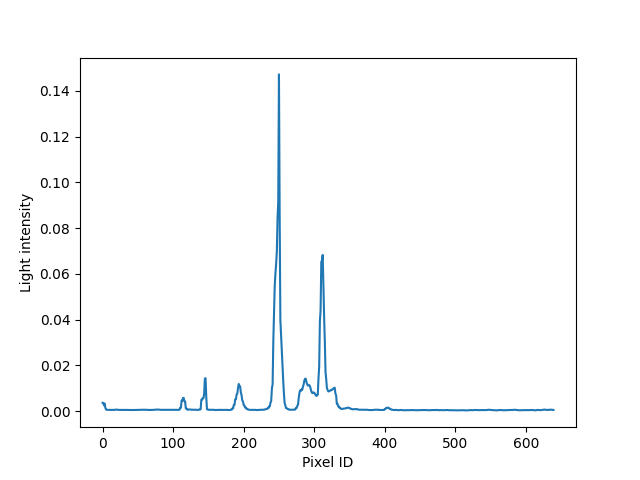

What it takes... Drones
=======================

.. https://docs.zephyrproject.org/latest/boards/nxp/vmu_rt1170/doc/index.html
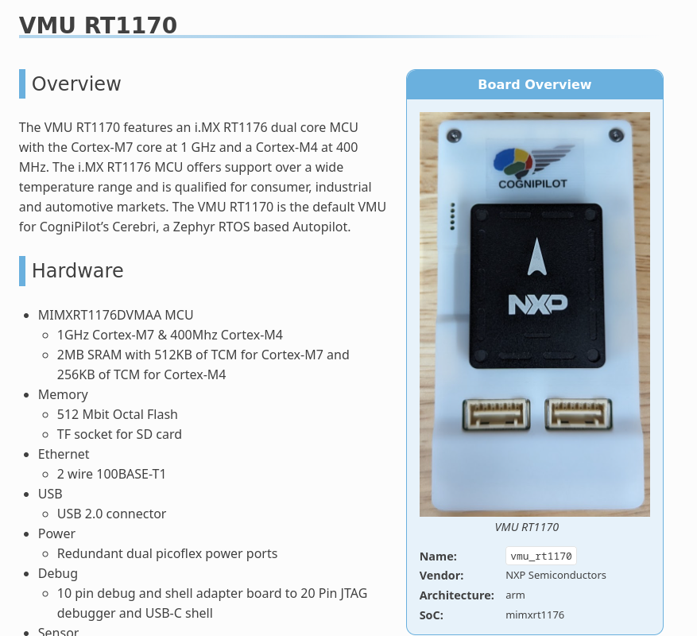
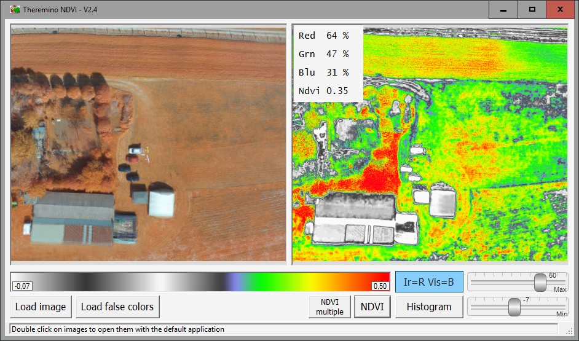

What it takes... Yeast monitoring station
=========================================

Monitoring process of beer, kombucha, lactic fermentation

Video but also...

`CO2 polling <https://docs.zephyrproject.org/latest/samples/sensor/co2_polling/README.html>`_ for building charts.

`LED API <https://docs.zephyrproject.org/latest/hardware/peripherals/led.html>`_ for illuminating when taking a capture.

`Wi-Fi <https://docs.zephyrproject.org/latest/connectivity/networking/api/wifi.html>`_ to the home router.

`HTTP client <https://docs.zephyrproject.org/latest/connectivity/networking/api/http_client.html>`_ for sending the results.

What it takes... Endoscopes
===========================

Cameras usged by surgeons

.. https://www.camemake.com/720p-ov9734-endoscope-camera-module/

Example of real endoscope camera module (CAMEMAKE):

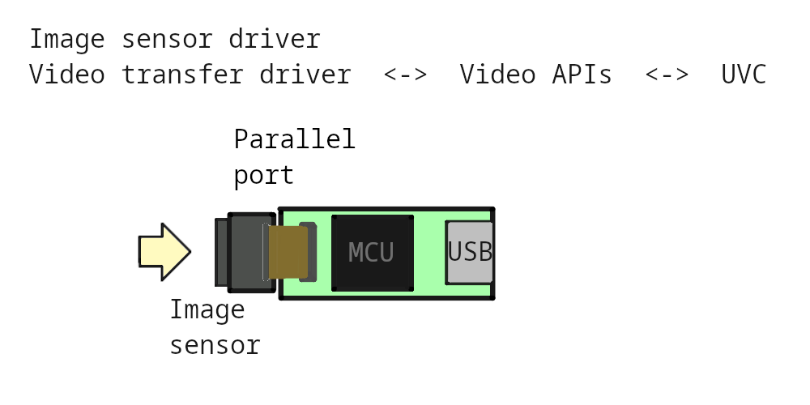

What it takes... Wi-Fi Smartglasses
===================================

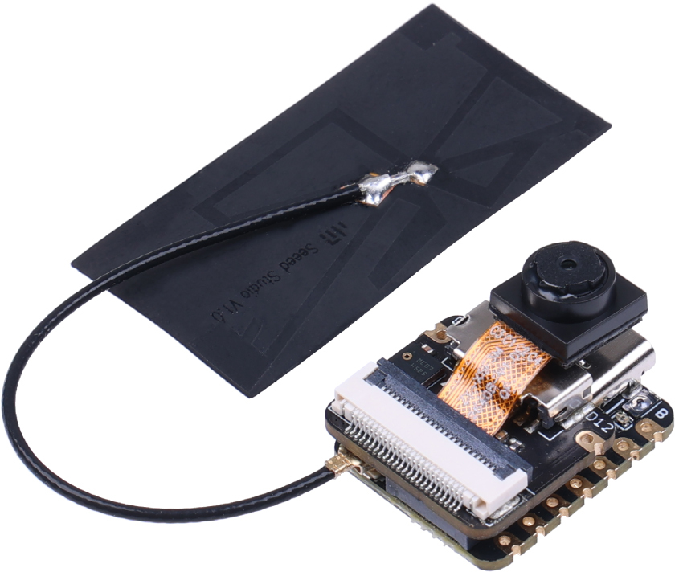

What it takes... Bluetooth Smartglasses
=======================================

.. https://github.com/NordicPlayground/nrf52-ble-image-transfer-demo
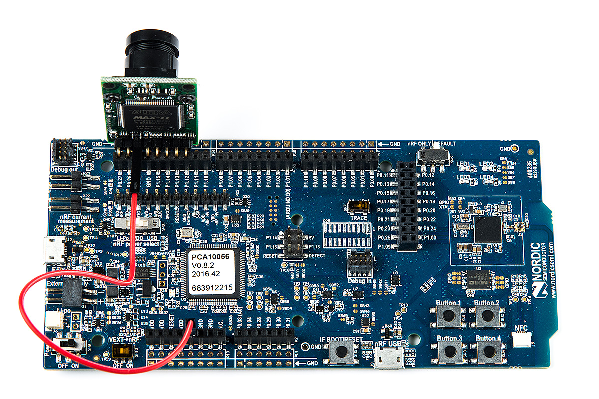

Pre-Zephyr Nordic era: needs conversion.

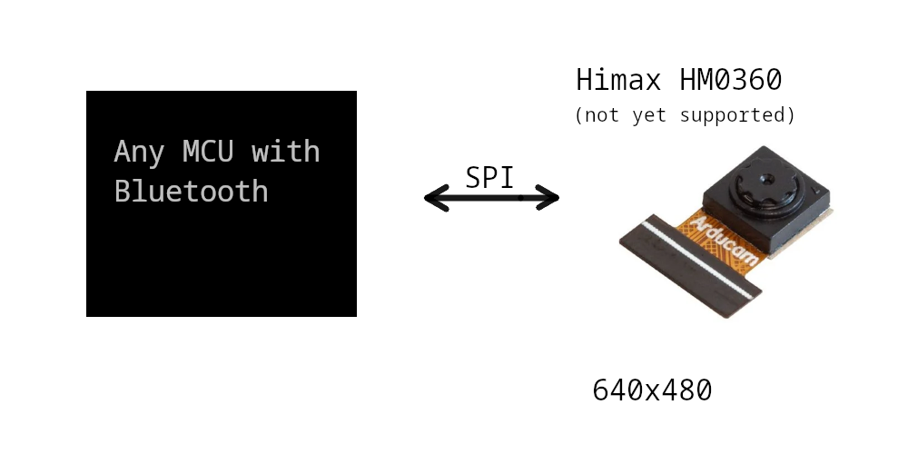

i.MX RT1170
===========

Cortex-M7 (small-medium) running at 1 GHz.

A fast CPU is good to reduce RAM usage:
transmit *more often* rather than *more at once*.

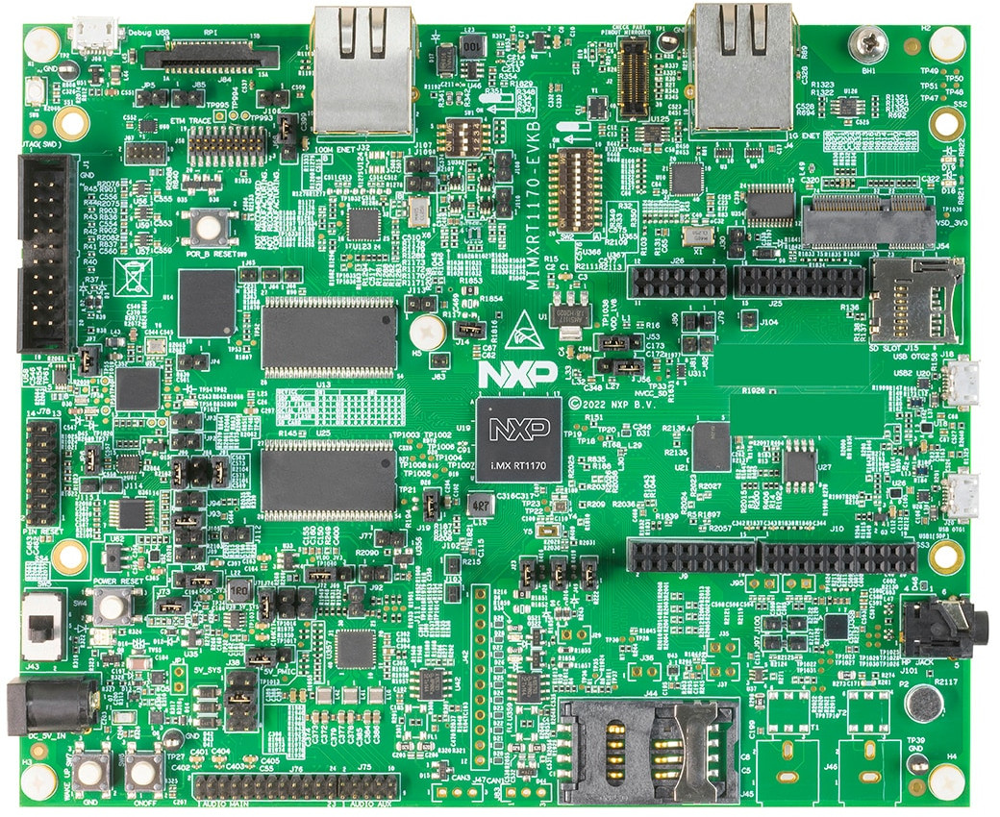

.. code-block::

   MIPI camera input (nxp,mipi-csi2rx)
   ||||||||||||||||||||||||||||||||||||||||||||||||||||||||||||||||||||||||||| 1500 MHz lane
   ||||||||||||||||||||||||||||||||||||||||||||||||||||||||||||||||||||||||||| 1500 MHz lane

   MIPI display output (nxp,imx-mipi-dsi) 1500 MHz, 2-lanes
   ||||||||||||||||||||||||||||||||||||||||||||||||||||||||||||||||||||||||||| 1500 MHz lane
   ||||||||||||||||||||||||||||||||||||||||||||||||||||||||||||||||||||||||||| 1500 MHz lane

   USB2 (nxp,ehci)
   |||||||||||||||||||||||| 480 MHz

   Ethernet (nxp,enet1g)
   |||||||||||||||||||||||||||||||||||||||||||||||||| 1000 MHz

   CPU cores (arm,cortex-m7 + arm,cortex-m4)
   |||||||||||||||||||||||||||||||||||||||||||||||||| 1000 MHz
   |||||||||||||||||||| 400 MHz

   + Video processing cores (cropping, resizing, color conversion)

tinyVision.ai tinyCLUNX33
=========================

A system specialized for MIPI to USB3 camera systems.
An FPGA: very slow CPU and needs to "build your own video cores".
Not upstream yet.

.. image:: img/tinyclunx33_som_v2.png
   :width: 100%

.. code-block::

   MIPI (tinyvision,uvcmanager)
   |||||||||||||||||||||||||||||||||||||||||||||||||||||||||||| 1200 MHz
   |||||||||||||||||||||||||||||||||||||||||||||||||||||||||||| 1200 MHz
   |||||||||||||||||||||||||||||||||||||||||||||||||||||||||||| 1200 MHz
   |||||||||||||||||||||||||||||||||||||||||||||||||||||||||||| 1200 MHz
   |||||||||||||||||||||||||||||||||||||||||||||||||||||||||||| 1200 MHz
   |||||||||||||||||||||||||||||||||||||||||||||||||||||||||||| 1200 MHz
   |||||||||||||||||||||||||||||||||||||||||||||||||||||||||||| 1200 MHz
   |||||||||||||||||||||||||||||||||||||||||||||||||||||||||||| 1200 MHz
   |||||||||||||||||||||||||||||||||||||||||||||||||||||||||||| 1200 MHz
   |||||||||||||||||||||||||||||||||||||||||||||||||||||||||||| 1200 MHz
 
   USB3 (lattice,usb23)
   |||||||||||||||||||||||||||||||||||||||||||||||||||||||||||||||||||||||||||
   |||||||||||||||||||||||||||||||||||||||||||||||||||||||||||||||||||||||||||
   |||||||||||||||||||||||||||||||||||||||||||||||||||||||||||||||||||||||||||
   ||||||||||||||||||||||||| 5000 MHz

   CPU core (tinyvision,vexriscv)
   |||| 80 MHz

FRDM-MCXN947
============

Dual Cortex-M33 (small) system with peripherals usually only found on
larger Linux-capable devices: "do more with less"

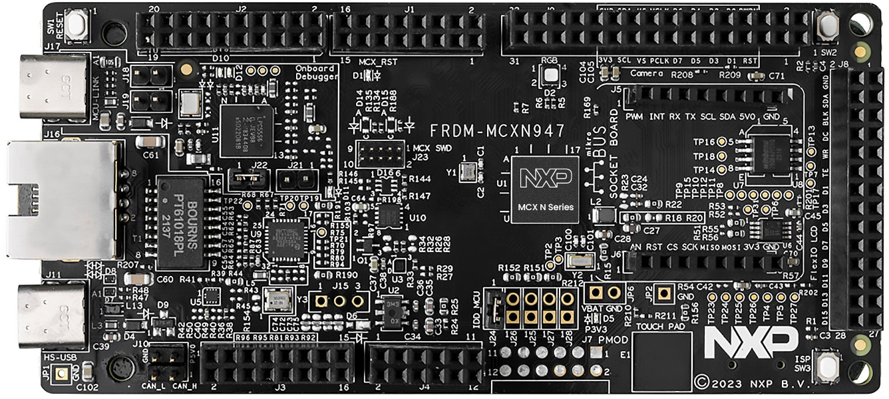

.. code-block::

   DVP camera input (nxp,video-smartdma)
   |||||||| |||||||| |||||||| |||||||| |||||||| |||||||| |||||||| 8 pins (16 max), 150 MHz each

   USB 2 (nxp,ehci)
   |||||||||||||||||||||||| 480 MHz

   Ethernet (nxp,enet-qos)
   ||||| 100 MHz

   CPU cores (arm,cortex-m33f)
   |||||||| 150 MHz
   |||||||| 150 MHz

   + eIQ NPU on-board for A.I. inference (release planned 2025 [1])

[1]: `eIQ`_ application note

.. _eIQ: https://community.nxp.com/pwmxy87654/attachments/pwmxy87654/MCX%40tkb/9/14/Add%20Machine%20Learning%20Functionality%20to%20Your%20NXP%20MCU-based%20Design%20(Tech%20Days%202024).pdf

XIAO ESP32S3 Sense
==================

Self-contained board for wireless (WiFi, Bluetooth),
coming with a camera and microphone.

.. code-block::

   DVP (espressif,lsd-cam)
   |||| |||| |||| |||| |||| |||| |||| |||| 8 pins (16 max) 80 MHz each

   Wi-Fi (espressif,esp32-wifi)
   |||||||| 150 Mbit/s

   CPU core (espressif,xtensa-lx7 + espressif,xtensa-lx7)
   |||||||||||| 240 MHz
   |||||||||||| 240 MHz

Arduino Nicla Vision (STM32H747)
================================

All-in-one board with IMU, microphone, 2 MP camera built-in, fast USB.

.. image:: img/Arduino-Nicla-Vision.png
   :width: 100%

.. code-block::

   DVP camera input (st,stm32-dcmi)
   |||| |||| |||| |||| |||| |||| |||| |||| 8-pins (14 max), 80 MHz each

   USB2 (st,stm32-otghs)
   |||||||||||||||||||||||| 480 MHz

   Wi-Fi (murata,1dx)
   |||| 65 Mbit/s

   CPU cores (arm,cortex-m7 + arm,cortex-m4)
   |||||||||||||||||||||||| 480 MHz
   |||||||||||| 240 MHz

   + JPEG compression core
   + Video processing operations (cropping, resizing, color conversion)

WeAct MiniSTM32H7xx
===================

Minimalist approach to a video devboard, comes with a camera and a display and fast USB.

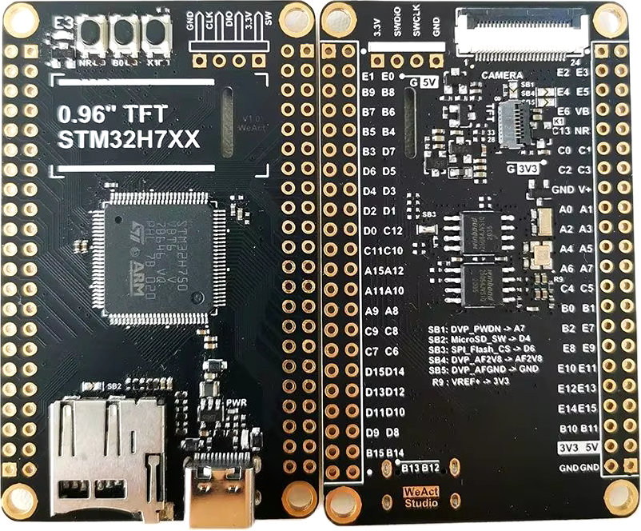

.. code-block::

   DVP camera input (st,stm32-dcmi)
   |||| |||| |||| |||| |||| |||| |||| |||| 8 pins (14 max), 80 MHz each

   USB2 (st,stm32-otghs / st,stm32-otghs)
   |||||||||||||||||||||||| 480 MHz
   | 12 MHz

   Ethernet (st,stm32h7-ethernet)
   ||||| 100 MHz

   CPU core (arm,cortex-m7)
   |||||||||||||||||||||||| 480 MHz

   + JPEG compression core
   + Video processing operations (cropping, resizing, color conversion)

A lot of different hardware with different capabilities!

How Zephyr RTOS helps: drivers with portable APIs.

Zephyr video API short summary

Some small recap about UVC features

Some small recap of ongoing changes, feat. new control API, Zephyr shell

Beyond Zephyr: ecosystem around it
==================================

What UVC adds to the table:

-> Linux interoperability
   Standardize all the video controls with Linux

-> ROS2: integration of robotics (via USB cameras)

-> OpenCV (via USB cameras)

-> USB camera protocol supported on Linux, Windows, MaxOS, Android, iPad (not iOS yet), BSDs, 9front, QNX...
   Laptop lid cameras

=> Want to suport a new sensor on any ecosystem?
   Bring Zephyr support, and now it's everywhere
