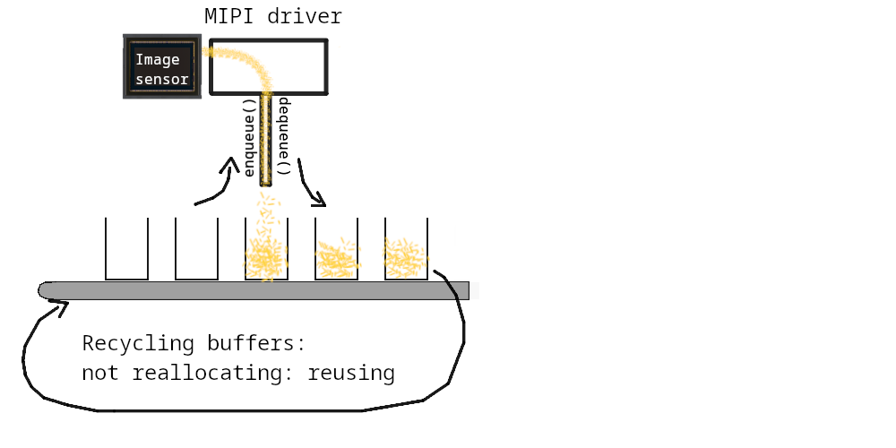
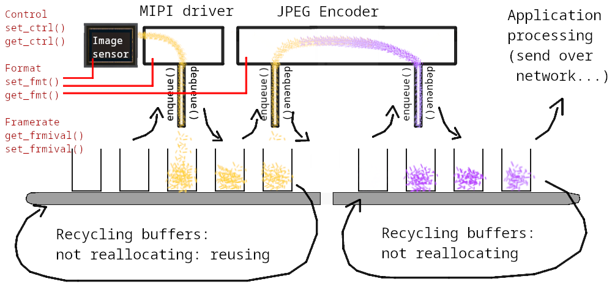

Embedded Video Systems With Zephyr
##################################

.. class:: titleslideinfo

   Josuah Demangeon, Panoramix Labs, tinyVision.ai

Background
==========

A contractor working essentially with tinyVision.ai

.. image:: img/tinyvision_lattice_devcon_2023.jpg

Autoportrait:
I am curious about a lot of topics, but only scratch the surface.

You are welcome and invited to dive in depth!

Video Systems
=============

Famous example: home cinema

.. image:: img/multimedia_home_cinema.jpg

.. image:: img/multimedia_system.png
   :width: 100%

.. image:: img/multimedia_system_annotated.png
   :width: 100%

.. image:: img/multimedia_system_folded.png
   :width: 100%

Embedded Video Systems
======================

Constraints:

-> Cost budget

-> Processing budget

-> Time budget (low-latency, real-time)

Can only work at low-resolution...

Embedded Video Systems
======================

Constraints:

-> Cost budget

-> Processing budget

-> Time budget (low-latency, real-time)

Can only work at low-resolution... <- FALSE!

.. image:: img/multimedia_system_camera.png
   :width: 100%

Embedded is not always low-end.

Embedded Video Systems
======================

"Why not use an USB camera?"

We are now implementing the USB camera *itself*.

.. image:: img/tinyclunx33_som_v2.png

.. image:: img/tinyclunx33_reference_design_dual_mipi_to_usb.png

Embedded Video Systems
======================

"Why not just a Raspberry Pi?"

-> Power budget

-> Performance

-> Cost

-> Latency

.. https://www.arducam.com/arducam-pivistation-5/
.. image:: img/arducam_pivistation.png

Embedded Video Systems
======================

Can be very large:

.. https://en.wikipedia.org/wiki/Very_Large_Telescope
.. image:: img/very_large_telescope.png

.. image:: img/very_large_telescope_inside.png

We can imagine a lot involved to assist the video function:

.. image:: img/very_large_telescope_inside_annotated.png

Still there on small embedded systems:

-> Motor for auto-focus ("VCM" motor ``#include <zephyr/drivers/video-controls.h>``)

-> I2C communication with other chips (``#include <zephyr/drivers/i2c.h>``)

-> Turning on/off the chip power (`Power Management <https://docs.zephyrproject.org/latest/services/pm/index.html>`_)

Embedded Video Systems
======================

But usually the smaller the better: how to shrink?

Switch from Linux OS -> RTOS like Zephyr

FFmpeg -> ???

Gstreamer -> ???

OpenCV -> ???

PyTorch -> ???

``/dev/video0`` -> ???

Everything to reinvent!
Needs a new ecosystem.

Zephyr Video APIs
=================

.. https://static.linaro.org/connect/san19/presentations/san19-503.pdf

.. image:: img/zephyr_api_big_picture.png

.. code-block:: dts

   imx219: imx219@10 {
           compatible = "sony,imx219";
           port {
                   imx219_ep_out: endpoint {
                           remote-endpoint-label = "mipi0_ep_in"; >>>
                   };
           };
   };

.. code-block:: dts

   mipi0: mipi@b1000010 {
           compatible = "tinyvision,mipi";
           port {
                   mipi0_ep_in: endpoint {
                           remote-endpoint-label = "imx219_ep_out"; <<<
                   };
                   mipi0_ep_out: endpoint {
                           remote-endpoint-label = "imx219_ep_in"; >>>
                   };
           };
   };

.. code-block:: dts

   jpegenc0: jpegenc@b1000010 {
           compatible = "tinyvision,jpegenc";
           port {
                   jpegenc0_ep_in: endpoint {
                           remote-endpoint-label = "jpegenc0_ep_in"; <<<
                   };

                   /* jpegenc0_ep_out: application */
           };
   };

Systems doing what?
===================

.. https://2384176.fs1.hubspotusercontent-na1.net/hubfs/2384176/Webinars/MIPI-Webinar-Introduction-MIPI-Camera-Command-Set-v1.pdf
.. image:: img/mipi_csi_imaging.png

On a journey from Phontons to Video
===================================

Photodiode
==========

Phenomenon of semiconductors producing voltage when exposed to the light.

.. image:: img/photodiode.jpeg
   :width: 40%

.. https://hackaday.com/2024/07/23/photoresistor-based-single-pixel-camera/
.. image:: img/singlepixel_altaz.jpeg
.. image:: img/singlepixel_photo.png

Note: photoresistor instead of photodiode here

.. code-block:: c
   :startinline: true

   #include <zephyr/drivers/pwm.h> // if using servomotors
   #include <zephyr/drivers/stepper.h> // if using stepper motors
   #include <zephyr/drivers/adc.h> // measure the light intensity

Photons -> Photonics
====================

Much more than just video:

-> Gas detection/characterization, i.e. NDIR CO2 sensors 

Industrial, safety, medical use-cases.

Since 1958: measuring Earth atmospheric CO2 with "1-pixel image sensors"

.. https://gml.noaa.gov/ccgg/behind_the_scenes/measurementlab.html
.. image:: img/noaa_measurement_lab.png

-> Biology/medical research, i.e. DNA sequencing

.. https://www.hamamatsu.com/content/dam/hamamatsu-photonics/sites/documents/99_SALES_LIBRARY/ssd/s13360_series_kapd1052e.pdf
.. image:: img/hamamatsu_dna_sequencing_sensor.png

Sensing voltage: not a very Linux thing to do...

Multiple sensors on a line
==========================

Line sensors: single cameras.

External systems measure responsible the voltage.
Sensing one pixel at a time, scanning through them fast.

.. image:: img/hamamatsu_dna_sequencing_sensor.png

Requires a fast ADC, i.e. ADI, contributing Zephyr RTOS

Multiple lines
==============

An image sensor, at last!

Line scanning hyperspectral.

Doing imaging but without a machine at the other end: computer vision.

Tools that can be used for building video systems: hardware to access the sensors implement all of that chain

-> Difficulty of embedded video: accessing parallel port or MIPI
-> Can use adapter chips like Himax WiseEye2 (Zephyr port might be coming too)

What comes out of an image sensor
=================================

Dark (no auto-exposure)
Green (no color correction)

Steps of an ISP.

Why an ISP is useful for robotics?

-> Get always values withing same range
-> Poor exposure: no data at all
-> Defisheye
-> Avoid artefacts to trigger a detection on the NPU or other vision algorithm

Conclusion: A lot to handle to get a reasonable image out of a sensor!

Hardware that can help accessing this image.

What it takes...
================

What would it take to build various devices on Zephyr

!! disclaimer: hardware is hard !!
!! disclaimer: not everything supported !!

What it takes... Spectrophotometer
==================================

.. image:: img/zephyr_on_spectrophotometer.png

Need a very fast ADC!
Not many board will have one...

=> Good to have a lot of options.

FPGAs are often used for this: Zephyr support depends on the soft SoC used.

.. https://github.com/OpnTec/open-spectrometer-python
.. image:: img/zephyr_on_spectrophotometer_IPA_Glass.png
.. image:: img/zephyr_on_spectrophotometer_1_IPA_Glass.png
.. image:: img/zephyr_on_spectrophotometer_2_IPA_Glass.png
.. image:: img/zephyr_on_spectrophotometer_cfl.png
.. image:: img/zephyr_on_spectrophotometer_cfl_plot.png

What it takes... Drones
=======================

.. https://docs.zephyrproject.org/latest/boards/nxp/vmu_rt1170/doc/index.html
.. image:: img/zephyr_on_drones.png
.. image:: img/theremino_ndvi.jpg

What it takes... Yeast monitoring station
=========================================

Monitoring process of beer, kombucha, lactic fermentation

Video but also...

`CO2 polling <https://docs.zephyrproject.org/latest/samples/sensor/co2_polling/README.html>`_ for building charts.

`LED API <https://docs.zephyrproject.org/latest/hardware/peripherals/led.html>`_ for illuminating when taking a capture.

`Wi-Fi <https://docs.zephyrproject.org/latest/connectivity/networking/api/wifi.html>`_ to the home router.

`HTTP client <https://docs.zephyrproject.org/latest/connectivity/networking/api/http_client.html>`_ for sending the results.

What it takes... Endoscopes
===========================

Cameras usged by surgeons

.. https://www.camemake.com/720p-ov9734-endoscope-camera-module/

Example of real endoscope camera module (CAMEMAKE):

.. image:: img/camemake_endoscope_1.jpeg

.. image:: img/zephyr_on_endoscope.png

What it takes... Wi-Fi Smartglasses
===================================

.. image:: img/Xiao-ESP32-S3-Sense.jpg

What it takes... Bluetooth Smartglasses
=======================================

.. https://github.com/NordicPlayground/nrf52-ble-image-transfer-demo
.. image:: img/video_on_bluetooth.jpeg

Pre-Zephyr Nordic era: needs conversion.

.. image:: img/zephyr_on_bluetooth_glasses.png

Beyond Zephyr: ecosystem around it
==================================

What UVC adds to the table:

-> Linux interoperability
   Standardize all the video controls with Linux

-> ROS2: integration of robotics (via USB cameras)

-> OpenCV (via USB cameras)

-> USB camera protocol supported on Linux, Windows, MaxOS, Android, iPad (not iOS yet), BSDs, 9front, QNX...
   Laptop lid cameras

=> Want to suport a new sensor on any ecosystem?
   Bring Zephyr support, and now it's everywhere
