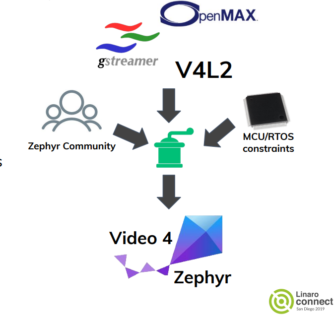
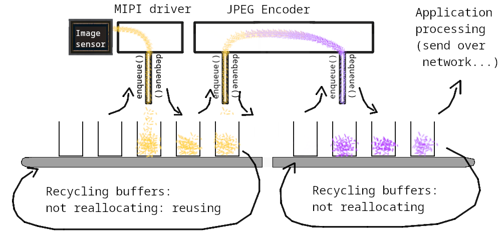
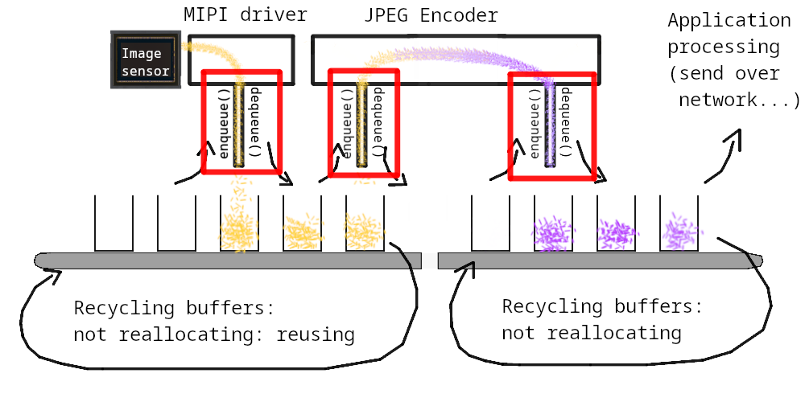
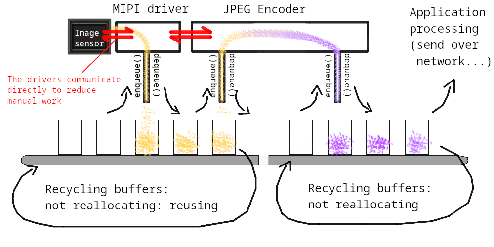
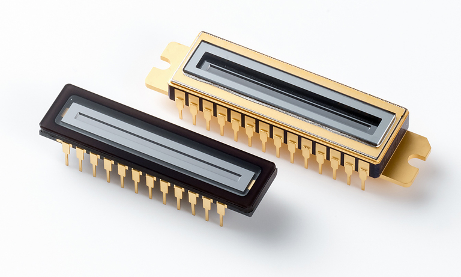
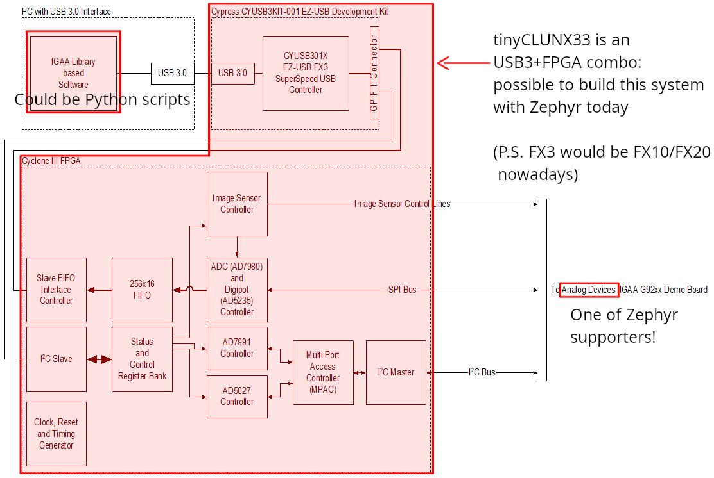
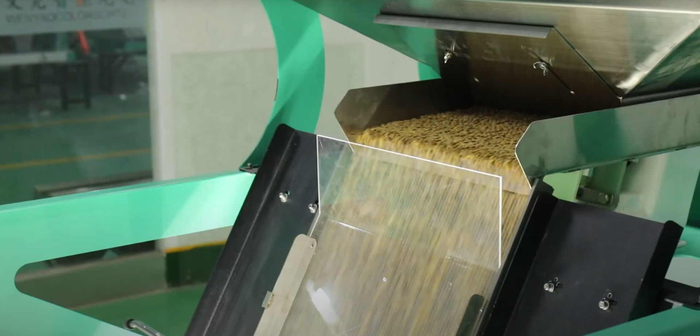
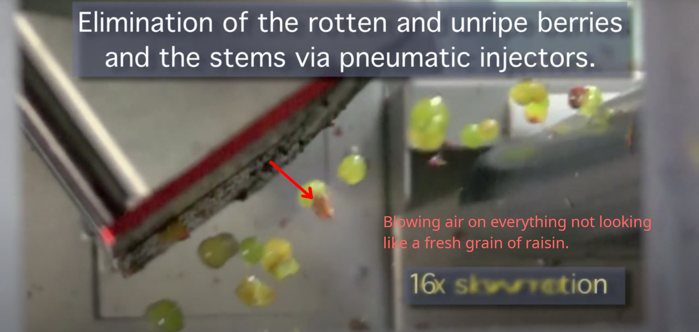
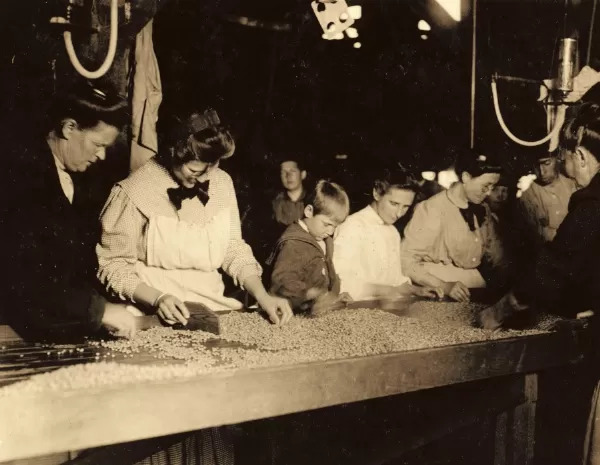
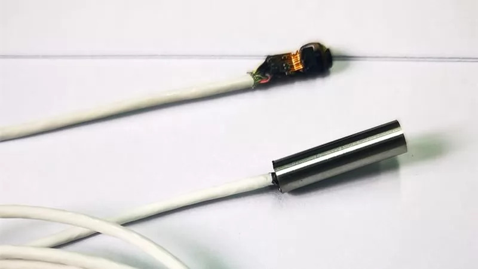

Embedded Video Systems With Zephyr
##################################

.. class:: titleslideinfo

   Josuah Demangeon, Panoramix Labs, tinyVision.ai

Background
==========

A contractor working essentially with tinyVision.ai

.. image:: img/tinyvision_lattice_devcon_2023.jpg

Autoportrait:
I am curious about a lot of topics, but only scratch the surface.

You are welcome and invited to dive in depth!

Video Systems
=============

Famous example: home cinema

.. image:: img/multimedia_home_cinema.jpg

.. image:: img/multimedia_system.png
   :width: 20cm

.. image:: img/multimedia_system_annotated.png
   :width: 20cm

.. image:: img/multimedia_system_folded.png
   :width: 20cm

Embedded Video Systems
======================

Constraints:

→ Cost budget

→ Processing budget

→ Time budget (low-latency, real-time)

Can only work at low-resolution...

Embedded Video Systems
======================

Constraints:

→ Cost budget

→ Processing budget

→ Time budget (low-latency, real-time)

Can only work at low-resolution... <- FALSE!

.. image:: img/multimedia_system_camera.png
   :width: 20cm

Embedded is not always low-end.

Embedded Video Systems
======================

"Why not use an USB camera?"

We are now implementing the USB camera *itself*.

.. image:: img/tinyclunx33_som_v2.png

tinyCLUNX33: the heart of an USB 3 webcam.

| 3.4 Gbit/s under 80 mW

.. image:: img/tinyclunx33_reference_design_dual_mipi_to_usb.png

Embedded Video Systems
======================

"Why not just a Raspberry Pi?"

→ Power budget

→ Performance

→ Cost

→ Latency

.. https://www.arducam.com/arducam-pivistation-5/
.. image:: img/arducam_pivistation.png

Embedded Video Systems
======================

Can be very large:

.. https://en.wikipedia.org/wiki/Very_Large_Telescope
.. image:: img/very_large_telescope.png

.. image:: img/very_large_telescope_inside.png

We can imagine a lot involved to assist the video function:

Still there on small embedded systems:

→ Motor for auto-focus ("VCM" motor ``#include <zephyr/drivers/video-controls.h>``)

→ I2C communication with other chips (``#include <zephyr/drivers/i2c.h>``)

→ Turning on/off the chip power (`Power Management <https://docs.zephyrproject.org/latest/services/pm/index.html>`_)

Embedded Video Systems
======================

But usually the smaller the better: how to shrink?

Switch from Linux OS → RTOS like Zephyr

Which board running it can do video?

Video-capable boards running Zephyr
===================================

Video-capable means DVP (a.k.a. parallel port) or MIPI support.

Different software ecosystem
============================

FFmpeg → ???

Gstreamer → ???

OpenCV → ???

PyTorch → ???

``/dev/video0`` → ???

These software assumes a lot of resources.
Everything to reinvent!

Zephyr Video APIs
=================

.. https://static.linaro.org/connect/san19/presentations/san19-503.pdf

.. image:: img/zephyr_api_single_core_annotated.png
   :width: 20cm

.. code-block:: c

   /* Error handling ommitted */

   video_stream_start(mipi_dev);
   vbuf = video_buffer_alloc(1280 * 720 * 3, K_FOREVER);
   while (true) {
       video_enqueue(mipi_dev, VIDEO_EP_OUT, vbuf);
       video_dequeue(mipi_dev, VIDEO_EP_OUT, &vbuf, K_FOREVER);
       /* do something with vbuf→data */
   }

.. code-block:: c

   /* Only one buffer of each */
   vbuf_raw = video_buffer_alloc(1280 * 720 * 3, K_FOREVER);
   vbuf_jpeg = video_buffer_alloc(JPEG_BUF_SIZE, K_FOREVER);
   while (true) {
       video_enqueue(mipi_dev, VIDEO_EP_OUT, vbuf_raw);
       video_dequeue(mipi_dev, VIDEO_EP_OUT, &vbuf_raw, K_FOREVER);
       video_enqueue(jpeg_dev, VIDEO_EP_IN, vbuf_raw);
       video_dequeue(jpeg_dev, VIDEO_EP_IN, &vbuf_raw, K_FOREVER);
       video_enqueue(jpeg_dev, VIDEO_EP_OUT, vbuf_jpeg);
       video_dequeue(jpeg_dev, VIDEO_EP_OUT, &vbuf_jpeg, K_FOREVER);
       /* Do something with the JPEG data */
   }

Nice and simple, but no concurrency: a lot of time spent waiting.

.. raw:: pdf

   FrameBreak 50

.. code-block:: c

   for (int i = 0; i < 3; i++) {
       vbuf_raw = video_buffer_alloc(1280 * 720 * 3, K_FOREVER);
       video_enqueue(mipi_dev, VIDEO_EP_OUT, vbuf_raw);
   }

   for (int i = 0; i < 3; i++) {
       vbuf_jpeg = video_buffer_alloc(JPEG_BUF_SIZE, K_FOREVER);
       video_enqueue(jpeg_dev, VIDEO_EP_OUT, vbuf_jpeg);
   }

   /* Thread 1: Handle the filled buffers */
   while (true) {
       video_dequeue(mipi_dev, VIDEO_EP_OUT, &vbuf_raw, K_FOREVER);
       video_enqueue(jpeg_dev, VIDEO_EP_IN, vbuf_raw);
   }

   /* Thread 2: Handle the emptied buffers */
   while (true) {
       video_dequeue(jpeg_dev, VIDEO_EP_IN, &vbuf_raw, K_FOREVER);
       video_enqueue(mipi_dev, VIDEO_EP_OUT, vbuf_raw);
   }

   /* Thread 3: Handle the JPEG buffers */
   while (true) {
       video_dequeue(jpeg_dev, VIDEO_EP_IN, &vbuf_jpeg, K_FOREVER);
       app_use_jpeg_buffer(vbuf_jpeg);
       video_enqueue(jpeg_dev, VIDEO_EP_OUT, &vbuf_jpeg, K_FOREVER);
   }

Fully parallel, but consumes a lot of threads: more memory overhead
and context switching.

.. raw:: pdf

   FrameBreak 50

.. code-block:: c

   /* First prepare a few buffers */

   /* Subscribe to the events */
   video_set_signal(mipi_dev, &signal);
   video_set_signal(jpeg_dev, &signal);

   /* React to the events */
   while (k_poll(&events, 1, K_FOREVER) == 0) {
       if (video_dequeue(mipi_dev, VIDEO_EP_OUT, &vbuf_raw, K_NO_WAIT) == 0) {
           video_enqueue(jpeg_dev, VIDEO_EP_IN, vbuf_raw);
       }
       if (video_dequeue(jpeg_dev, VIDEO_EP_IN, &vbuf_raw, K_NO_WAIT) == 0) {
           video_enqueue(mipi_dev, VIDEO_EP_OUT, vbuf_raw);
       }
       if (video_dequeue(jpeg_dev, VIDEO_EP_OUT, &vbuf_jpeg, K_NO_WAIT) == 0) {
           video_enqueue(jpeg_dev, VIDEO_EP_OUT, vbuf_jpeg);
           app_use_jpeg_buffer();
       }
   }

Good parallelism, single thread (more scalable).
Maybe this can be automated for easier pipelines.

.. code-block:: dts

   imx219: imx219@10 {
           compatible = "sony,imx219";
           port {
                   imx219_ep_out: endpoint {
                           remote-endpoint-label = "mipi0_ep_in";
                   };
           };
   };

.. code-block:: dts

   mipi0: mipi@b1000010 {
           compatible = "tinyvision,mipi";
           port {
                   mipi0_ep_in: endpoint {
                           remote-endpoint-label = "imx219_ep_out";
                   };

                   mipi0_ep_out: endpoint {
                           remote-endpoint-label = "jpegenc_ep_in";
                   };
           };
   };

.. code-block:: dts

   jpegenc0: jpegenc@b1000010 {
           compatible = "tinyvision,jpegenc";
           port {
                   jpegenc0_ep_in: endpoint {
                           remote-endpoint-label = "mipi0_ep_in";
                   };
                   /* jpegenc0_ep_out: to the application */
           };
   };

Next steps: automating more of the pipeline?
What would make it more convenient?

Systems doing what?
===================

On a journey from Phontons to Video, and how that is used

.. https://2384176.fs1.hubspotusercontent-na1.net/hubfs/2384176/Webinars/MIPI-Webinar-Introduction-MIPI-Camera-Command-Set-v1.pdf
.. image:: img/mipi_csi_imaging.png

Photodiode
==========

Phenomenon of semiconductors producing voltage when exposed to the light.

.. image:: img/photodiode.jpeg
   :width: 40%

.. https://hackaday.com/2024/07/23/photoresistor-based-single-pixel-camera/
.. image:: img/singlepixel_altaz.jpeg
.. image:: img/singlepixel_photo.png

Note: photoresistor instead of photodiode here

.. code-block:: c
   :startinline: true

   #include <zephyr/drivers/pwm.h> // if using servomotors
   #include <zephyr/drivers/stepper.h> // if using stepper motors
   #include <zephyr/drivers/adc.h> // measure the light intensity

Photons → Photonics
====================

Much more than just video:

→ Gas detection/characterization, i.e. NDIR CO2 sensors 

Industrial, safety, medical use-cases.

Since 1958: measuring Earth atmospheric CO2 with "1-pixel image sensors"

.. https://gml.noaa.gov/ccgg/behind_the_scenes/measurementlab.html

→ Biology/medical research, i.e. DNA sequencing

.. https://www.hamamatsu.com/content/dam/hamamatsu-photonics/sites/documents/99_SALES_LIBRARY/ssd/s13360_series_kapd1052e.pdf

Sensing voltage: not a very Linux thing to do...

A single line of pixels
=======================

Line sensors: a single line at a time.

Not digital interface but analog interface: need an ADC to get digital readout.

Sensing one pixel at a time, need to go fast!

Requires a fast ADC to handle the input.

Hamamatsu recommends an FPGA (customizable chip) + Analog Devices Analog-Digital-Converter (ADC).

.. https://hub.hamamatsu.com/us/en/technical-notes/image-sensors/ingaas-linear-sensor-reference-circuit-design-section-2.html
.. image:: img/hamamatsu_diagram.jpeg

.. https://eu.mouser.com/pdfDocs/ADI_A118386_Integration-Collaboration.pdf

Multiple lines
==============

Tools that can be used for building video systems: hardware to access the sensors implement all of that chain

→ Difficulty of embedded video: accessing parallel port or MIPI

→ Can use adapter chips like Himax HX6538 (not yet supported) or small FPGAs

What comes out of an image sensor
=================================

Dark (no auto-exposure)
Green (no color correction)

Steps of an ISP.

Why an ISP is useful for robotics?

→ Get always values withing same range

→ Poor exposure: no data at all

→ De-fisheye

→ Avoid artefacts to trigger a detection on the NPU or other vision algorithm

Conclusion: A lot to handle to get a reasonable image out of a sensor!

Hardware that can help accessing this image.

What it takes...
================

What would it take to build various devices on Zephyr

!! disclaimer: hardware is hard !!

!! disclaimer: not everything shown has drivers !!

Also works without Zephyr, just putting things in perspective.

What it takes... Spectrophotometer
==================================

.. image:: img/zephyr_on_spectrophotometer.png

Need a very fast ADC!
Not many board will have one...

→ Good to have a lot of options.

.. https://github.com/OpnTec/open-spectrometer-python
.. image:: img/zephyr_on_spectrophotometer_IPA_Glass.png
.. image:: img/zephyr_on_spectrophotometer_1_IPA_Glass.png

.. image:: img/zephyr_on_spectrophotometer_cfl_plot.png

What it takes... Drones
=======================

.. https://docs.zephyrproject.org/latest/boards/nxp/vmu_rt1170/doc/index.html
.. image:: img/zephyr_on_drones.png

What it takes... Yeast monitoring station
=========================================

Monitoring process of beer, kombucha, lactic fermentation

Video but also...

`CO2 polling <https://docs.zephyrproject.org/latest/samples/sensor/co2_polling/README.html>`_ for building charts.

`LED API <https://docs.zephyrproject.org/latest/hardware/peripherals/led.html>`_ for illuminating when taking a capture.

`Video controls API <https://docs.zephyrproject.org/latest/doxygen/html/group__video__controls.html>`_ for manual exposure tuning during "flash".

`Wi-Fi <https://docs.zephyrproject.org/latest/connectivity/networking/api/wifi.html>`_ to the home router.

`HTTP client <https://docs.zephyrproject.org/latest/connectivity/networking/api/http_client.html>`_ for sending the results.

What it takes... Sorting machine
================================

Fastest board you can get!
Most real-time you can get!

.. 

.. https://www.youtube.com/watch?v=vbSww5SBqN4

What it takes... Endoscopes/Borescope
=====================================

Cameras usged by surgeons

.. https://www.camemake.com/720p-ov9734-endoscope-camera-module/

Example of real endoscope camera module (CAMEMAKE):

What it takes... Wi-Fi Smartglasses
===================================

.. image:: img/Xiao-ESP32-S3-Sense.jpg

What it takes... Bluetooth Smartglasses
=======================================

Pre-Zephyr Nordic era: needs conversion.

.. https://github.com/NordicPlayground/nrf52-ble-image-transfer-demo

Beyond Zephyr: ecosystem around it
==================================

What UVC adds to the table:

→ USB camera protocol supported on Linux, Windows, MaxOS, Android, iPad (not iOS yet), BSDs, 9front, QNX... (thanks to laptop lid cameras)

→ Linux interoperability: Standardize all the video controls with Linux

→ ROS2: integration of robotics (via USB cameras)

→ OpenCV (via USB cameras)

→ Want to suport a new sensor on any ecosystem? Bring Zephyr support, and now it's everywhere
